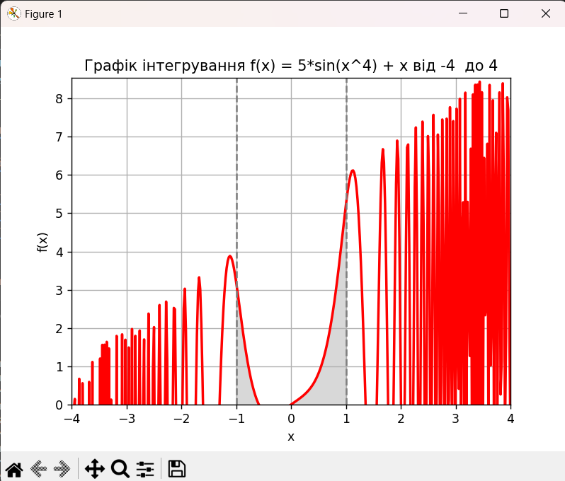
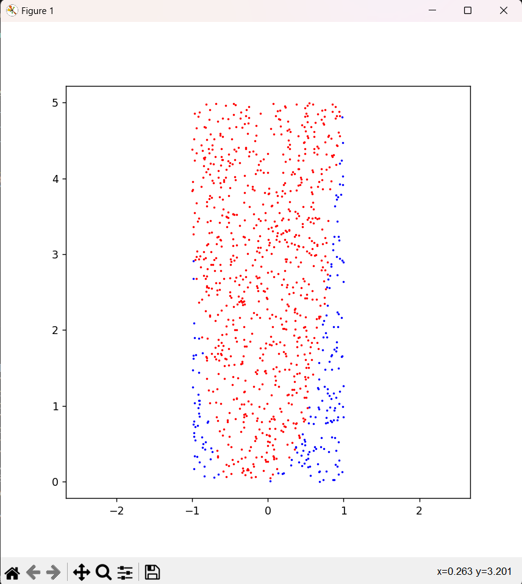
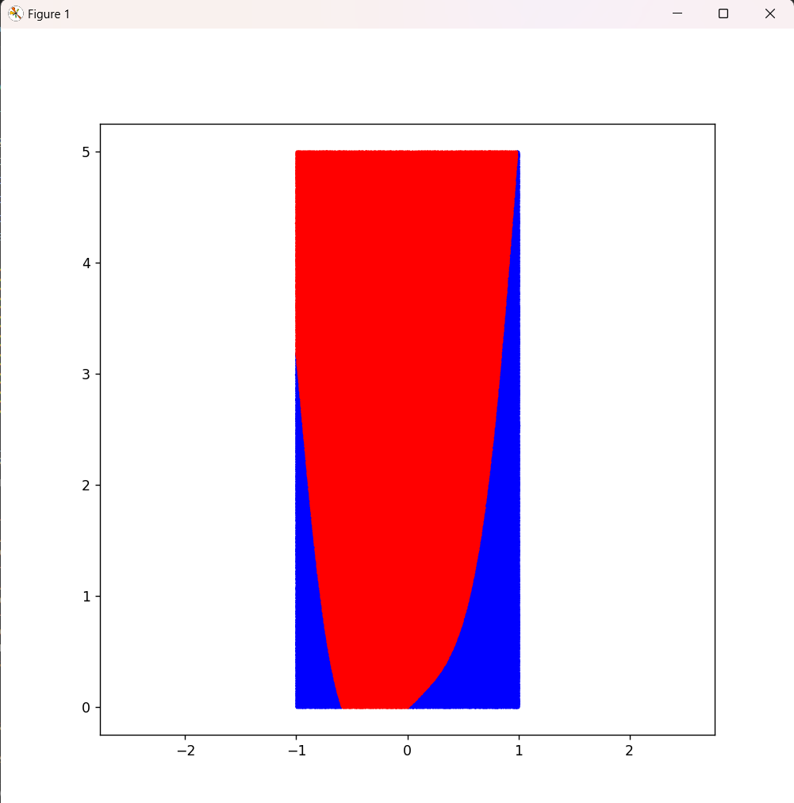

# Висновок

в другому завданні було порівняно два методи визначено площі фігури утвореної функцією `f(x) = 5*sin(x^4) + x`:
  - за допомогою бібліотеки SciPy, а точніше методу  `quad`

  - за допомогою методу Монте-Карло

На рисунку 1 зображено графік досліджуваної функції, а також межі інтегрування (від -1 до 1)



*Рисунок 1 - Графік функції f(x) = 5*sin(x^4) + x*

Крім того досліджено точність методу Монте-Карло, в порівнянні з визначеним SciPy значенням, вибравши множину точок, які формують загальний графік, а саме:

- __1000 точок (рис.2)__
  


*Рисунок 2 - Графік побудований на основі методу Монте-Карло за 1_000 випадкових точок*

- __1_000_000 точок (рис.3)__
  


*Рисунок 2 - Графік побудований на основі методу Монте-Карло за 1_000_000 випадкових точок*


- __100_000_000 точок (не вистачило памяті компютера для відображення даного графіку)__

Виконавши розрахунок площі, а точніше, визначення інтегралу, ми отримали наступні результати (дані результати можуть відрізнятись для кожного окремого випадку, оскільки розміщення точок на графіку відбувається рандомно)
```
Визначення площі фігури утвореної функцією f(x) = 5*sin(x^4) + x за використання:

   - бібліотеки SciPy                       - інтеграл = 1.8756954468467124, з точністю 2.733980652028971e-08
   
   - методу Монте-Карло (1_000 точок)       - інтеграл = 2.19
   
   - методу Монте-Карло (1_000_000 точок)   - інтеграл = 1.97804
   
   - методу Монте-Карло (100_000_000 точок) - інтеграл = 1.9768629

```
Виходячи з отриманих результатів, можна сказати наступне:

- SciPy метод `quad` дозволяє швидко та з хорошою точністю визначати інтеграл
- точність методу Монте-Карло залежить від кількості випадкових точок (чим більше тим точніше)
- зі збільшенням кількості випадкових точок, для методу Монте-Карло, спостерігається наближення результату розрахунку інтегралу до бібліотечного SciPy варіанту
- збільшення випадкових точок, для методу Монте-Карло, призводить до додаткових значних часових та просторових затрат
- можна судити, що використання методу Монте-Карло для визначення інтегралу можливе, якщо потрібно визначити останнього швидко і з незначною точністю
